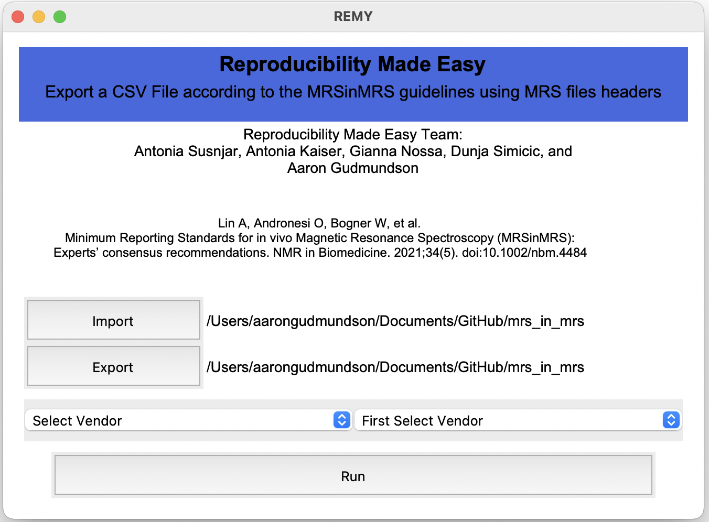
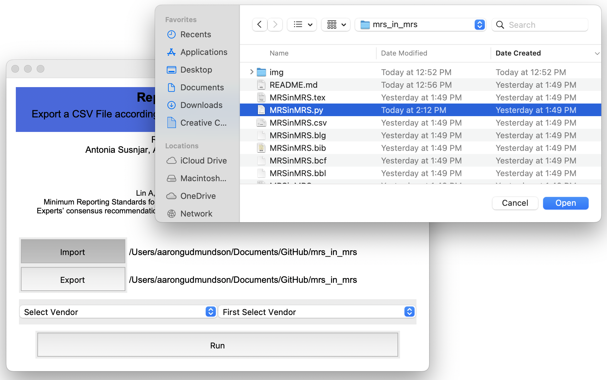
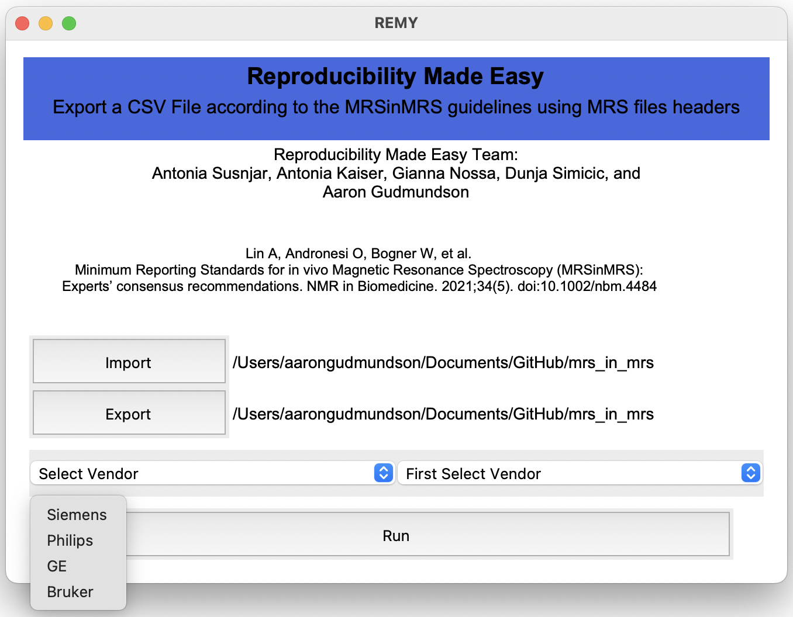
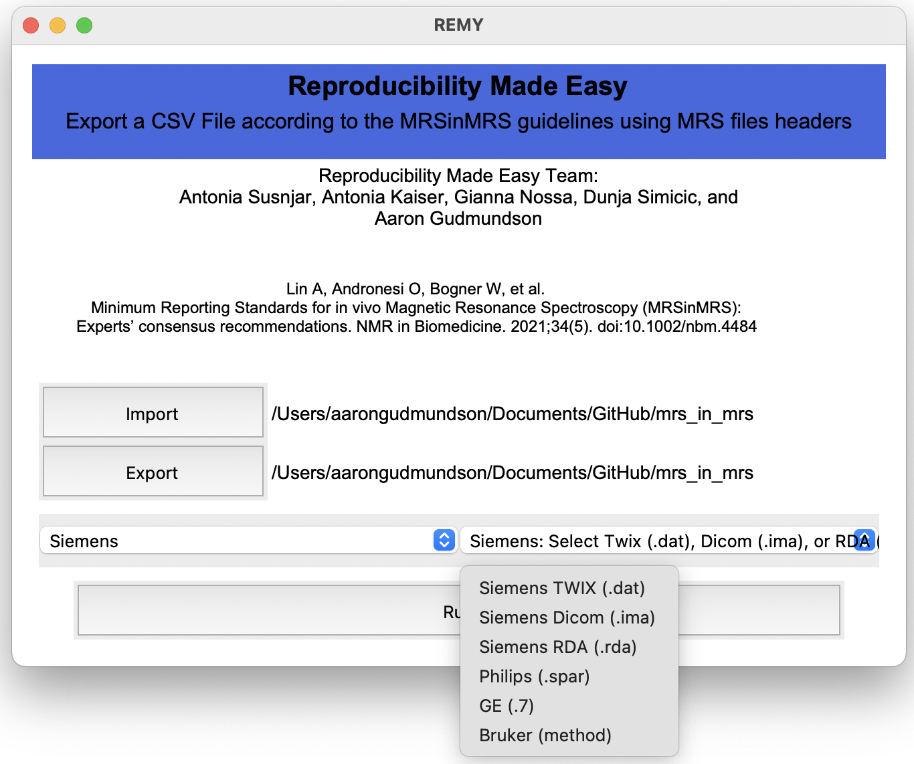
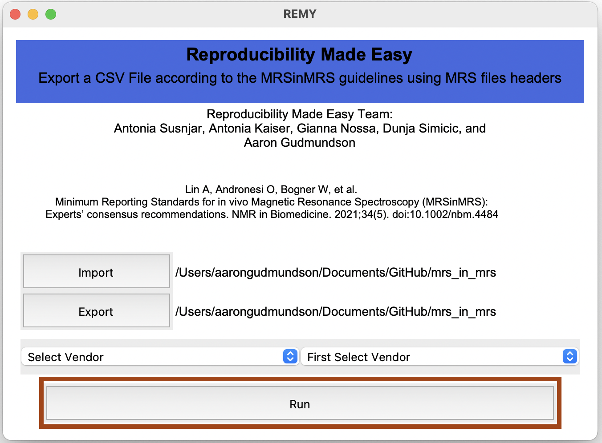

# Reproducibility Made Easy:
The ***Reproducibility Made Easy (RMY)*** application provides researchers and clinicians the ability to comprehensively document study parameters. It automates table population from a single datafile, facilitating result replication, and method evaluation. This software also generates a straight-forward MRS methods section which ensures reporting accuracy and result interpretability.

## Summary:
At the 2023 inaugural MRS Hackathon, Antonia Susnjar suggested a need for an automated software pipeline to encourage adherence to the consensus Minimum Reporting Standards in Magnetic Resonance Spectroscopy (MRS in MRS). 

## Keywords:
Magnetic Resonance Spectroscopy, Automated Software, MRS in MRS Consensus

## Uses:
A fully automated cross-platform software application for completing the MRS in MRS Table and generating a MRS-specific methods section

## Citation:
If you find this tool useful, please cite:

> Susnjar, A., Kaiser, A., Simicic, D., Nossa, G., Lin, A., Oeltzschner, G., & Gudmundson, A. (2024). Reproducibility Made Easy: A Tool for Methodological Transparency and Efficient Standardized Reporting based on the proposed MRSinMRS Consensus (arXiv:2403.19594). arXiv. https://doi.org/10.48550/arXiv.2403.19594.

## Instructions:
### Desktop Application
1. ***Download:***

	
Download the REMY version for your specific platform.

	<table>
		<tr>
			<td style="border:hidden;"><b>Windows</b></td>
			<td style="border:hidden;">REMY\_Windows.exe</td>
		</tr>
		<tr>
			<td style="border:hidden;"><b>Mac</b></td>
			<td style="border:hidden;">REMY\_Mac</td>
		</tr>
		<tr>
			<td style="border:hidden;"><b>Linux (Ubuntu)</b></td>
			<td style="border:hidden;">REMY\_Linux\_Ubuntu.tar.gz</td>
		</tr>
	</table>

2. ***Running the Application:***

	
Once downloaded, double click to run the application.

	
	
	
To begin select your data file using the Import Button. The output files will automatically be exported to the same folder using the same name as input file. However, use the Export option if you would like to export to a different location.

	
	
	
Now that you've selected your data, choose the vendor from the "Select Vendor" dropdown menu.

	
	
	
Finally, choose the file type using the next dropdown menu.

	
	
	
Finally, choose the file type using the next dropdown menu and click "Run" at the bottom.

	
	

## Dependencies:
- Python3
- Numpy
- Pandas
- spec2nii
- nifti-mrs
- mrstools
